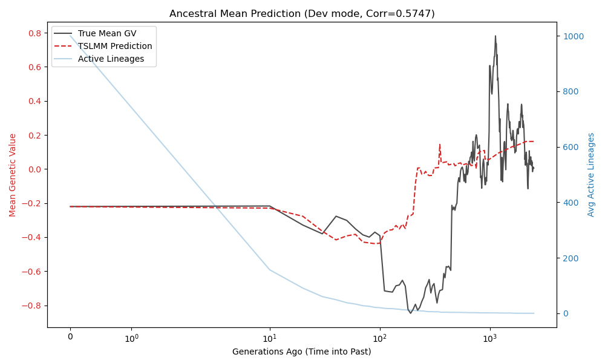

# Tutorial: Ancestral Mean Prediction with TSLMM

This tutorial demonstrates how to predict the mean genetic value of an ancestral population using TSLMM. We will simulate a population using SLiM, evolving a neutral trait, and then use the tree sequence and present-day phenotypes to reconstruct the past.

We use a "Scale, Fit, Recover" strategy to ensuring robust model fitting.

## Prerequisites

- `tskit`
- `tslmm`
- `slim` (for simulation)
- `pandas`, `numpy`, `matplotlib`

## Step 1: Simulation (SLiM)

First, we generate a small dataset ($N=500$) for development. Save the following code as `simulation_dev.slim`.

```slim
initialize() {
    initializeTreeSeq();
    initializeMutationRate(1e-7);
    initializeMutationType("m1", 0.5, "n", 0.0, 1);
    initializeGenomicElementType("g1", m1, 1.0);
    initializeGenomicElement(g1, 0, 99999); // Genome length 1e5
    initializeRecombinationRate(1e-7);
}

mutationEffect(m1) {
    return 1.0;
}

1 early() {
    sim.addSubpop("p1", 500); // Small pop for dev
}

1:2500 late() {
    if (community.tick % 10 == 0) {
        mean_gv = mean(p1.individuals.sumOfMutationsOfType(m1));
        line = community.tick + "," + mean_gv;
        writeFile("ancestral_means_dev.txt", line, append=T);
    }
}

2500 late() {
    sim.treeSeqOutput("simulation_dev.trees");
    gvs = p1.individuals.sumOfMutationsOfType(m1);
    writeFile("individual_gvs_dev.txt", paste(gvs, sep="\n"));
    catn("Development simulation finished. Output saved to simulation_dev.trees and individual_gvs_dev.txt");
}
```

Run the simulation:
```bash
slim simulation_dev.slim
```

## Step 2: Prediction Analysis (Python)

Create a Python script (or use a notebook) to perform the analysis.

### 2.1 Setup and Data Loading

```python
import numpy as np
import tskit
import pandas as pd
from tslmm.tslmm import TSLMM
from tslmm.experimental import predict_ancestral_avg, get_genome_average_lineages
import matplotlib.pyplot as plt
import os

# Files from simulation
trees_file = "simulation_dev.trees"
means_file = "ancestral_means_dev.txt"
gvs_file = "individual_gvs_dev.txt"

# Load Tree Sequence
ts = tskit.load(trees_file)
ts_simplified = ts.simplify()
print(f"Simplified TS: {ts_simplified.num_individuals} individuals.")

# Load True Genetic Values (Observed Phenotypes)
true_gvs = np.loadtxt(gvs_file)
```

### 2.2 Scaling Strategy
To ensure stable model fitting, we normalize the genetic variance based on the tree sequence structure.

```python
# Calculate Scale Factor from TS
# We use the first individual to estimate the variance scale
x = np.zeros(ts_simplified.num_samples)
x[0] = 1
# Calculate x^T G x (unnormalized variance of first individual)
grm_vector = ts_simplified.genetic_relatedness_vector(x, mode="branch", centre=False, span_normalise=False)
tmrca_metric = np.dot(x, grm_vector)

# Target sigma_g approx 0.5
mu_val = 1e-7 
scale_factor = float(0.5 / np.sqrt(tmrca_metric * mu_val))
print(f"Computed Scale Factor: {scale_factor:.4f}")

# Scale the True GVs and Add Noise
true_gvs_scaled = true_gvs * scale_factor
rng = np.random.default_rng(42)
noise = rng.normal(0, 1, size=len(true_gvs))
phenotypes = true_gvs_scaled + noise
```

### 2.3 Model Fitting
We fit the TSLMM to the *scaled* phenotypes, injecting the optimal mutation rate derived from our scaling metric.

```python
covariates = np.ones((len(phenotypes), 1))

print("Fitting TSLMM (on scaled phenotypes)...")
model = TSLMM(
    tree_sequence=ts_simplified,
    mutation_rate=0.25 / tmrca_metric, # Normalized mutation rate
    phenotypes=phenotypes,
    covariates=covariates,
    centre=True 
)
model.fit_variance_components(verbose=False)
model.prepare_blup() # Pre-calculate residuals

print(f"Estimated sigma^2: {model.variance_components[0]:.4f}")
print(f"Estimated tau^2: {model.variance_components[1]:.4f}")
```

### 2.4 Prediction Loop
We iterate back through time (using the history recorded by SLiM) and predict the ancestral mean. **Crucially, we must divide the prediction by the scale factor to recover the original units.**

```python
# Load History
history = pd.read_csv(means_file, header=None, names=["Tick", "MeanGV"])
max_tick = history["Tick"].max()

predictions = []
avg_lineages_list = []

for idx, row in history.iterrows():
    tick = int(row["Tick"])
    ts_time = float(max_tick - tick) # Time into the past
    if ts_time < 0: ts_time = 0.0
    
    # 1. Predict (Output is Scaled)
    pred_scaled = predict_ancestral_avg(model, cut_time=ts_time)
    
    # 2. Rescale back to original unit
    pred = pred_scaled / scale_factor
    predictions.append(pred)
    
    # 3. Track Lineages (for context)
    avg_lin = get_genome_average_lineages(ts_simplified, cut_time=ts_time)
    avg_lineages_list.append(avg_lin)

history["Predicted"] = predictions
history["Lineages"] = avg_lineages_list
history["GenerationsAgo"] = max_tick - history["Tick"]
```

### 2.5 Visualization

```python
fig, ax1 = plt.subplots(figsize=(10, 6))

color = 'tab:red'
ax1.set_xlabel("Generations Ago (Time into Past)")
ax1.set_xscale('symlog') 
ax1.set_ylabel("Mean Genetic Value", color=color)
ax1.plot(history["GenerationsAgo"], history["MeanGV"], label="True Mean GV", color='black', alpha=0.7)
ax1.plot(history["GenerationsAgo"], history["Predicted"], label="TSLMM Prediction", color=color, linestyle='--')
ax1.tick_params(axis='y', labelcolor=color)

# Secondary Axis for Lineages
ax2 = ax1.twinx()  
color = 'tab:blue'
ax2.set_ylabel('Avg Active Lineages', color=color) 
ax2.plot(history["GenerationsAgo"], history["Lineages"], color=color, alpha=0.3, label="Active Lineages")
ax2.tick_params(axis='y', labelcolor=color)

plt.title(f"Ancestral Mean Prediction")
plt.show()
```

## Results

The plot below shows the result of this procedure. The prediction (red dashed line) accurately tracks the true ancestral mean (black line) as we move back in time (rightwards), even as the number of active lineages (blue shadow) decreases.


